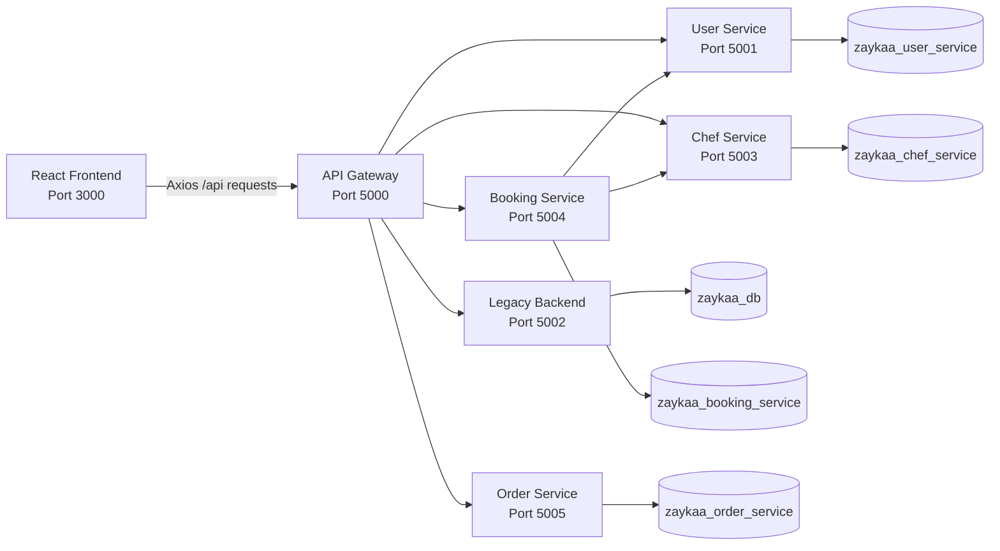
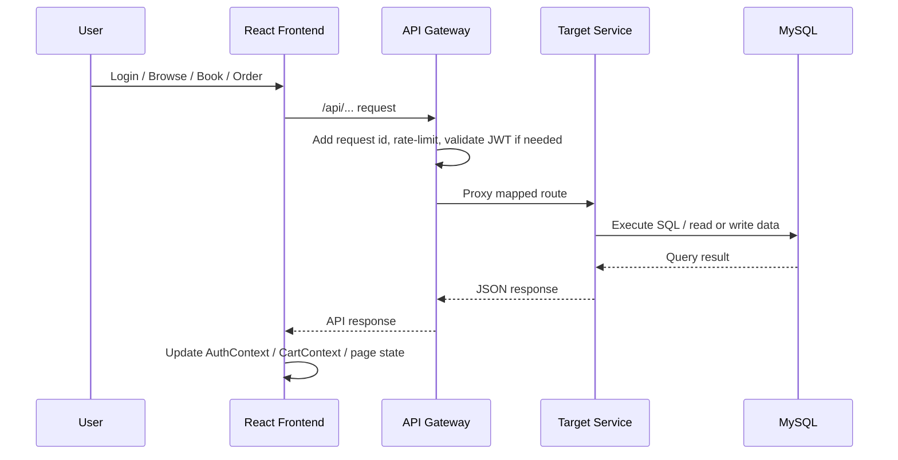

# Zaykaa Start

Zaykaa Start is a full-stack food platform that combines:

- user and chef authentication
- chef discovery and at-home chef booking
- restaurant browsing, cart, coupon, and order flows
- chef-side booking, recipe, menu, and analytics tools
- a migration-in-progress backend made of an API gateway, multiple Flask microservices, and a legacy Flask compatibility backend

The current codebase is in a migration phase. The React frontend already talks to the API gateway, the gateway routes requests to the new microservices, and a smaller legacy backend still exists for compatibility and fallback behavior.

## Project Status

This repository currently has two backend styles running side by side:

1. New microservices:
   - `user_service`
   - `chef_service`
   - `booking_service`
   - `order_service`
   - `api_gateway`
2. Legacy compatibility backend:
   - `zaykaa-backend`

The recommended local workflow is to start the whole stack from the repository root with `npm start`, which launches the frontend, gateway, microservices, and legacy backend together.

## What The Project Does

### User-facing features

- register and log in as a user or chef
- browse chefs and view chef availability
- book a chef for a home dining experience
- browse restaurants and menus
- manage a single-restaurant cart
- validate coupons and place food orders
- view recent orders on the dashboard

### Chef-facing features

- view chef bookings
- update chef booking status
- manage recipes
- manage chef menu UI
- view chef analytics

### Platform/API features

- JWT-based authentication
- gateway-level request logging and in-memory rate limiting
- gateway compatibility aliases so the existing frontend can keep using simpler `/api/...` paths
- raw SQL + MySQL for the microservices
- schema bootstrap on service startup

## Architecture



## Information Flow

### Request flow



### Login flow

1. User submits email and password from the React login page.
2. Frontend calls `/api/auth/login`.
3. API gateway proxies that request to `user_service` at `/api/v1/users/auth/login`.
4. `user_service` validates credentials, generates JWT, and returns user data.
5. Frontend stores token and user info in `localStorage` through `AuthContext`.
6. Future API requests automatically include `Authorization: Bearer <token>` through the shared Axios instance.

### Booking flow

1. Frontend loads available chefs from `/api/chefs/available`.
2. Gateway maps that to `chef_service`.
3. User selects a chef and requests availability.
4. Gateway maps availability to `booking_service`.
5. User submits booking details to `/api/bookings`.
6. `booking_service` checks its own data and coordinates with `user_service` and `chef_service` as needed.

### Ordering flow

1. Frontend loads restaurants from `/api/restaurants`.
2. Gateway proxies that to `order_service`.
3. User adds items to the cart; `CartContext` keeps one restaurant active at a time.
4. Frontend can validate coupons with `/api/coupons/validate`.
5. User submits `/api/orders`.
6. `order_service` creates the order, order items, and status history.

## Repository Layout

```text
Zaykaa_Start/
|-- README.md
|-- package.json
|-- requirements.txt
|-- docker-compose.yml
|-- scripts/
|   `-- start-dev.js
|-- microservices/
|   |-- api_gateway/
|   |-- user_service/
|   |-- chef_service/
|   |-- booking_service/
|   `-- order_service/
|-- zaykaa-backend/
|   `-- app.py
`-- zaykaa-frontend/
    |-- package.json
    `-- src/
        |-- pages/
        |-- components/
        |-- services/
        |-- context/
        `-- styles/
```

## Runtime Components

| Component | Port | Purpose | Data Store | Notes |
|---|---:|---|---|---|
| Frontend | 3000 | React UI for users and chefs | Browser state, localStorage | Started via `react-scripts` |
| API Gateway | 5000 | Single entry point, JWT validation, aliases, rate limiting | None directly | Proxies to services and fallback backend |
| User Service | 5001 | Auth, profile, preferences, meal plans, nutrition | `zaykaa_user_service` | Raw SQL, MySQL pool |
| Legacy Backend | 5002 | Compatibility backend for legacy routes and fallback behavior | `zaykaa_db` | Flask-SQLAlchemy |
| Chef Service | 5003 | Chef profiles, discovery, recipes, analytics | `zaykaa_chef_service` | Raw SQL, MySQL pool |
| Booking Service | 5004 | Chef booking lifecycle | `zaykaa_booking_service` | Talks to user + chef services |
| Order Service | 5005 | Restaurants, cart, coupons, orders | `zaykaa_order_service` | Raw SQL, MySQL pool |
| MySQL | 3306 | Main database server | All DBs above | Local MySQL or Docker MySQL |

## Frontend

### Main routes

| Route | Purpose | Access |
|---|---|---|
| `/login` | User/chef login | Public |
| `/register` | Registration | Public |
| `/dashboard` | User landing page + recent orders | Authenticated |
| `/book-chef` | Chef browsing and booking | Authenticated |
| `/order` | Restaurant browsing, menu, cart, and checkout | Authenticated |
| `/chef-dashboard` | Chef bookings, recipes, menu, analytics | Authenticated, role=`chef` |

### Frontend state and client behavior

- `AuthContext` stores the JWT token and current user in `localStorage`.
- `CartContext` stores the active restaurant cart and enforces one restaurant per cart session.
- The shared Axios client points to `REACT_APP_API_URL` and defaults to `http://localhost:5000/api`.
- Axios automatically adds the Bearer token to requests.
- A `401` response clears local auth state and redirects the user back to `/login`.

### Important frontend files

- `zaykaa-frontend/src/App.js`
- `zaykaa-frontend/src/context/AuthContext.js`
- `zaykaa-frontend/src/context/CartContext.js`
- `zaykaa-frontend/src/services/api.js`
- `zaykaa-frontend/src/pages/*`

## Backend Design

### Shared microservice patterns

Each microservice follows a similar structure:

- `controllers/` for Flask blueprints and HTTP request handling
- `services/` for business logic
- `repositories/` for SQL/database access
- `database/` for connection bootstrap, schema, and raw SQL query files
- `middleware/` for auth and error handling
- `utils/` for validators, logging, responses, and JWT helpers

### Startup behavior

On startup, each microservice:

1. loads environment variables
2. configures logging
3. bootstraps its database schema from `schema.sql`
4. initializes a MySQL connection pool
5. registers Flask blueprints
6. exposes a `/health` endpoint

### API gateway responsibilities

The gateway is the main backend entry point for the frontend and currently handles:

- request logging with request ids
- in-memory rate limiting
- JWT validation for protected routes
- proxying `/api/v1/...` service routes
- compatibility aliases such as `/api/auth/login`, `/api/bookings`, `/api/restaurants`, `/api/orders/recent`
- fallback proxying to the legacy backend for routes not yet migrated

### Legacy backend responsibilities

The legacy backend still provides or simulates:

- `/api/auth/register`
- `/api/auth/login`
- `/api/chefs/available`
- `/api/chefs/:id/availability`
- `/api/restaurants`
- `/api/orders`
- `/api/orders/recent`
- `/api/bookings`
- `/api/health`

It uses Flask-SQLAlchemy instead of the raw SQL + repository structure used by the new services.

## Service Breakdown

### User Service

Responsibilities:

- register and log in users
- verify/logout sessions
- manage user profile
- manage preferences
- meal plan CRUD
- nutrition log CRUD
- nutrition summary reporting

Docs:

- [User Service README](microservices/user_service/README.md)

### Chef Service

Responsibilities:

- chef profile CRUD
- public chef discovery
- chef availability management
- recipe CRUD
- ratings aggregation
- chef analytics snapshot

Docs:

- [Chef Service README](microservices/chef_service/README.md)

### Booking Service

Responsibilities:

- create bookings
- validate chef availability
- show user booking history
- show chef booking queue
- update booking status
- cancellation flow
- booking analytics

Docs:

- [Booking Service README](microservices/booking_service/README.md)

### Order Service

Responsibilities:

- restaurant catalog
- menu items
- coupon validation
- cart storage/update
- order creation
- order history
- order tracking
- order cancellation

Docs:

- [Order Service README](microservices/order_service/README.md)

### API Gateway

Responsibilities:

- route mapping and proxying
- request throttling
- JWT guard
- aggregated health reporting
- compatibility layer between current frontend routes and the new service URLs

Docs:

- [API Gateway README](microservices/api_gateway/README.md)

## Database Overview

The workspace currently uses five MySQL databases:

| Database | Used By | Purpose | Examples of Main Tables |
|---|---|---|---|
| `zaykaa_db` | Legacy backend | Legacy compatibility data store | `users`, `chefs`, `orders` |
| `zaykaa_user_service` | User service | Auth, profile, preferences, nutrition | `users`, `user_preferences`, `meal_plans`, `nutrition_logs` |
| `zaykaa_chef_service` | Chef service | Chef data and recipes | `chef_profiles`, `chef_availability_slots`, `recipes` |
| `zaykaa_booking_service` | Booking service | Booking lifecycle | `bookings`, `booking_status_history` |
| `zaykaa_order_service` | Order service | Catalog, cart, coupons, orders | `restaurants`, `menu_items`, `orders`, `order_items` |

### Database bootstrap

Each microservice schema file starts with `CREATE DATABASE IF NOT EXISTS ...` and `USE ...`, so the service can create its own database structure on startup as long as MySQL is reachable with sufficient privileges.

## Tech Stack

| Layer | Stack |
|---|---|
| Frontend | React 19, React Router DOM 7, Axios, CSS |
| Frontend build | Create React App / `react-scripts` 5 |
| API Gateway | Flask 3, Requests, custom proxy layer |
| Microservices | Flask 3, raw SQL, `mysql-connector-python`, JWT, CORS |
| Legacy backend | Flask 3, Flask-SQLAlchemy, PyMySQL, bcrypt |
| Authentication | JWT |
| Database | MySQL 8 |
| Dev orchestration | Node.js script (`scripts/start-dev.js`) |
| Containerization | Docker Compose |

## Prerequisites

- Python 3.13+
- Node.js 22.14.0 or compatible
- npm 10.9.2 or compatible
- MySQL 8.x running locally if you use the local startup path
- Docker Desktop / Docker Engine if you use the Compose path

Important note:

- The repository is configured to use your system Python installation for services.
- A local virtual environment is not required by the root workflow.

## Environment Configuration

The project reads environment variables from:

- `zaykaa-backend/.env`
- `microservices/user_service/.env`
- `microservices/chef_service/.env`
- `microservices/booking_service/.env`
- `microservices/order_service/.env`
- `microservices/api_gateway/.env`

### Shared values used across the stack

| Key | Meaning |
|---|---|
| `JWT_SECRET` | Shared JWT signing secret |
| `DB_HOST` | MySQL host |
| `DB_PORT` | MySQL port |
| `DB_USER` | MySQL username |
| `DB_PASSWORD` | MySQL password |
| `DB_NAME` | Target database name |
| `CORS_ORIGINS` | Allowed frontend origins |

### Gateway-specific values

| Key | Meaning |
|---|---|
| `USER_SERVICE_URL` | User service base URL |
| `CHEF_SERVICE_URL` | Chef service base URL |
| `BOOKING_SERVICE_URL` | Booking service base URL |
| `ORDER_SERVICE_URL` | Order service base URL |
| `LEGACY_BACKEND_URL` | Legacy backend base URL |
| `RATE_LIMIT_WINDOW_SECONDS` | Rate-limit window |
| `RATE_LIMIT_MAX_REQUESTS` | Max requests per window |

### Frontend-specific value

| Key | Meaning | Default |
|---|---|---|
| `REACT_APP_API_URL` | Base URL for frontend API calls | `http://localhost:5000/api` |

## How To Run

### Option A: Full local development stack

This is the most complete way to run the project because it starts:

- frontend
- API gateway
- user service
- chef service
- booking service
- order service
- legacy backend

Steps:

1. Install Python packages into your system Python:

   ```powershell
   python -m pip install -r requirements.txt
   ```

   If `python` is not on PATH:

   ```powershell
   py -3 -m pip install -r requirements.txt
   ```

2. Install frontend packages:

   ```powershell
   npm run frontend:install
   ```

3. Make sure MySQL is running and reachable at the host/port expected by your `.env` files.

4. Start the full stack:

   ```powershell
   npm start
   ```

5. Open the frontend:

   - `http://localhost:3000`

6. Check gateway health:

   - `http://localhost:5000/api/health`

### Option B: Docker Compose

`docker-compose.yml` currently starts:

- MySQL
- user service
- chef service
- booking service
- order service
- API gateway

It does not currently start:

- the React frontend
- the legacy compatibility backend

Run it with:

```powershell
docker compose up --build
```

If you use Docker Compose and also need the frontend or legacy backend, run those separately outside Docker.

### Option C: Run services individually

| Component | Command |
|---|---|
| Frontend | `cd zaykaa-frontend && npm start` |
| Gateway | `cd microservices/api_gateway && python app.py` |
| User service | `cd microservices/user_service && python app.py` |
| Chef service | `cd microservices/chef_service && python app.py` |
| Booking service | `cd microservices/booking_service && python app.py` |
| Order service | `cd microservices/order_service && python app.py` |
| Legacy backend | `cd zaykaa-backend && python app.py` |

## Root NPM Scripts

| Command | Purpose |
|---|---|
| `npm start` | Start the full local stack |
| `npm run frontend:install` | Install frontend dependencies |
| `npm run frontend:audit` | Run `npm audit` for the frontend package |
| `npm run frontend:audit:fix` | Run a non-force audit fix for the frontend package |
| `npm run frontend:audit:fix:force` | Run a force audit fix for the frontend package |

## Health Checks And Verification

### HTTP health endpoints

- Gateway: `http://localhost:5000/health` and `http://localhost:5000/api/health`
- User service: `http://localhost:5001/health`
- Legacy backend: `http://localhost:5002/api/health`
- Chef service: `http://localhost:5003/health`
- Booking service: `http://localhost:5004/health`
- Order service: `http://localhost:5005/health`

### Database connectivity

The expected local MySQL databases are:

- `zaykaa_db`
- `zaykaa_user_service`
- `zaykaa_chef_service`
- `zaykaa_booking_service`
- `zaykaa_order_service`

If the services start successfully, they bootstrap their schema and expose healthy status responses. You can also verify MySQL connectivity directly with a small Python or MySQL client probe if needed.

## API Map

The frontend primarily uses these gateway aliases:

| Frontend capability | Gateway route examples | Downstream service |
|---|---|---|
| Auth | `/api/auth/register`, `/api/auth/login`, `/api/auth/logout`, `/api/auth/verify` | `user_service` |
| User APIs | `/api/v1/users/...` | `user_service` |
| Chef browse | `/api/chefs/available`, `/api/chefs/:id`, `/api/chefs/:id/recipes` | `chef_service` |
| Chef availability / bookings | `/api/chefs/:id/availability`, `/api/bookings`, `/api/bookings/my` | `booking_service` |
| Chef dashboard | `/api/chef/bookings`, `/api/chef/recipes`, `/api/chef/analytics` | `booking_service` + `chef_service` |
| Ordering | `/api/restaurants`, `/api/orders`, `/api/orders/cart`, `/api/orders/recent`, `/api/coupons/validate` | `order_service` |
| Fallback legacy routes | `/api/<path>` | `zaykaa-backend` |

For the full route lists and example payloads, see:

- [API Gateway README](microservices/api_gateway/README.md)
- [User Service README](microservices/user_service/README.md)
- [Chef Service README](microservices/chef_service/README.md)
- [Booking Service README](microservices/booking_service/README.md)
- [Order Service README](microservices/order_service/README.md)

## Current Notes And Limitations

- The project is in a migration phase, so the gateway and legacy backend both still matter.
- The React app has clear user and chef flows; `agent` and `vlogger` appear in registration data, but dedicated frontend dashboards/routes for them are not implemented in the current UI.
- Docker Compose currently covers the microservices stack, but not the frontend or legacy backend.
- The frontend can still show ESLint warnings in some booking components; those are warnings, not startup blockers.
- The frontend dependency tree still has remaining `npm audit` items because `react-scripts@5` brings older transitive packages. A blind `npm audit fix --force` is not recommended without validating the build.
- The legacy backend is intentionally smaller than the original monolith and acts mainly as a compatibility layer.

## Troubleshooting

### `react-scripts is not recognized`

Install frontend dependencies:

```powershell
npm run frontend:install
```

### `npm audit fix --force` fails at the repo root

Use the root helper scripts instead:

```powershell
npm run frontend:audit
npm run frontend:audit:fix
```

Reason:

- the real React package and lockfile live inside `zaykaa-frontend`
- the repo root is an orchestration package, not the frontend app itself

### Python package import errors

Reinstall Python dependencies:

```powershell
python -m pip install -r requirements.txt
```

### MySQL connection errors

Check:

- MySQL is running
- the `.env` values match your local database server
- the configured user has permission to create/use the required databases

## Recommended Reading Order

If you are new to this repository, read in this order:

1. this `README.md`
2. `scripts/start-dev.js`
3. `zaykaa-frontend/src/App.js`
4. `microservices/api_gateway/src/routes.py`
5. the individual service READMEs
6. `zaykaa-backend/app.py` for the compatibility layer

## Quick Start Summary

```powershell
python -m pip install -r requirements.txt
npm run frontend:install
npm start
```

Then open:

- Frontend: `http://localhost:3000`
- Gateway health: `http://localhost:5000/api/health`

