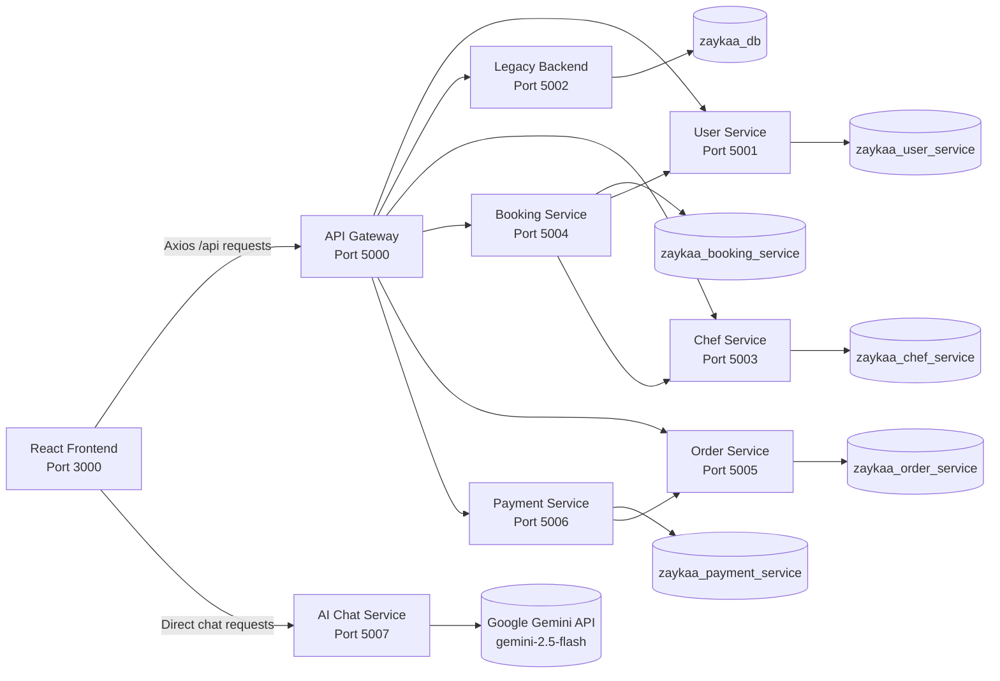
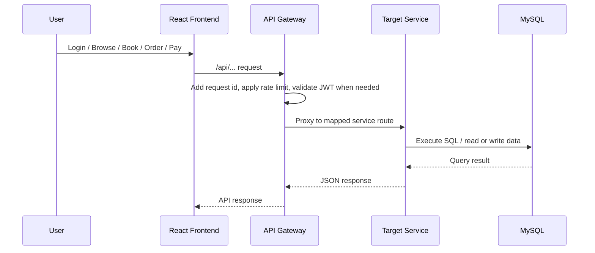

# Zaykaa - The Homely Cravings

Zaykaa is a full-stack food platform that combines:

- account registration and JWT-based authentication
- chef discovery, availability lookup, and at-home chef bookings
- restaurant browsing, cart, coupon validation, and food ordering
- chef profile, recipe, ratings, and analytics workflows
- user profile, preferences, meal plan, and nutrition tracking APIs
- payment, refund, payout, and payment-event workflows

The repository is in an active migration phase. The React frontend talks to the API gateway, the gateway proxies requests to Flask microservices, and a smaller legacy Flask backend still exists for compatibility and fallback behavior.

## Recent Updates

- Added `ai_chat_service` on port `5007`, a Gemini-powered recipe assistant chatbot (Zaykaa Chef AI) accessible from the frontend with dark mode, saved recipes, and markdown responses
- Added `payment_service` on port `5006`, plus gateway aliases for `/api/payments` and `/api/payouts`
- Added the `zaykaa_payment_service` MySQL database to the stack and Docker Compose flow
- Expanded user and chef profile/location support with `native_state` and `native_region`
- Added public and managed recipe APIs, plus a frontend `/recipes` route
- Frontend now uses Tailwind CSS, Framer Motion, theme state, and toast state in addition to auth and cart state

## Project Status

The workspace currently runs two backend styles side by side:

1. New microservices:
   - `api_gateway`
   - `user_service`
   - `chef_service`
   - `booking_service`
   - `order_service`
   - `payment_service`
   - `ai_chat_service`
2. Legacy compatibility backend:
   - `zaykaa-backend`

The recommended local workflow is to start the stack from the repository root with `npm start`. That launches the frontend, gateway, all current microservices, and the legacy backend together.

## What The Platform Does

### User-facing features

- register and log in
- browse chefs and public recipes
- check chef availability and place chef bookings
- browse restaurants and menus
- manage a single-restaurant cart
- validate coupons and place food orders
- review recent orders from the dashboard

### Chef/platform-facing features

- manage chef profiles and availability
- manage chef-owned recipes
- view chef bookings and update booking status
- add ratings and fetch analytics snapshots
- initiate payments, verify payments, process refunds, and create payouts through the new payment APIs

### Platform/API features

- JWT authentication across gateway and services
- gateway request logging with request ids
- in-memory rate limiting at the gateway
- gateway alias routes so the frontend can keep using simple `/api/...` paths
- raw SQL plus MySQL connection pooling for the microservices
- schema bootstrap and lightweight migrations on service startup

## Architecture



## Request Flow



## Repository Layout

```text
Zaykaa_Start/
|-- README.md
|-- package.json
|-- requirements.txt
|-- docker-compose.yml
|-- scripts/
|   `-- start-dev.js
|-- microservices/
|   |-- api_gateway/
|   |-- user_service/
|   |-- chef_service/
|   |-- booking_service/
|   |-- order_service/
|   |-- payment_service/
|   `-- ai_chat_service/
|-- zaykaa-backend/
|   `-- app.py
`-- zaykaa-frontend/
    |-- package.json
    |-- tailwind.config.js
    `-- src/
        |-- pages/
        |-- components/
        |   `-- Bot/
        |-- services/
        |-- context/
        `-- styles/
```

## Runtime Components

| Component | Port | Purpose | Data Store | Notes |
|---|---:|---|---|---|
| Frontend | 3000 | React UI for users and chefs | Browser state, localStorage | Started via `react-scripts` |
| API Gateway | 5000 | Entry point, JWT validation, aliases, rate limiting, aggregated health | None directly | Proxies to services and optional legacy fallback |
| User Service | 5001 | Auth, profile, preferences, meal plans, nutrition | `zaykaa_user_service` | Raw SQL, MySQL pool |
| Legacy Backend | 5002 | Compatibility backend for fallback routes | `zaykaa_db` | Flask-SQLAlchemy |
| Chef Service | 5003 | Chef profiles, discovery, availability, recipes, ratings, analytics | `zaykaa_chef_service` | Raw SQL, MySQL pool |
| Booking Service | 5004 | Chef booking lifecycle and availability checks | `zaykaa_booking_service` | Calls user and chef services as needed |
| Order Service | 5005 | Restaurants, cart, coupons, orders | `zaykaa_order_service` | Raw SQL, MySQL pool |
| Payment Service | 5006 | Payments, refunds, payouts, payment events | `zaykaa_payment_service` | Integrates with order data and provider abstractions |
| AI Chat Service | 5007 | Gemini-powered recipe chatbot (Zaykaa Chef AI) | None (session memory) | Uses `google-genai` SDK with `gemini-2.5-flash` |
| MySQL | 3306 | Main database server | All DBs above | Local MySQL or Docker MySQL |

## Frontend

### Main routes

| Route | Purpose | Access |
|---|---|---|
| `/login` | User and chef login | Public |
| `/register` | Registration | Public |
| `/dashboard` | User landing page and recent orders | Authenticated |
| `/recipes` | Recipe discovery page | Authenticated |
| `/book-chef` | Chef browsing and booking | Authenticated |
| `/order` | Restaurant browsing, menu, cart, and checkout | Authenticated |
| `/chef-dashboard` | Chef bookings, recipes, profile, and analytics tools | Authenticated, role=`chef` |

### Frontend state and client behavior

- `AuthContext` stores the JWT token and current user in `localStorage`
- `CartContext` stores the active cart and enforces one restaurant at a time
- `ThemeProvider` handles theme preferences across the app shell
- `ToastProvider` powers in-app feedback and status toasts
- The shared Axios client defaults to `REACT_APP_API_URL=http://localhost:5000/api`
- Axios automatically adds the Bearer token when a session exists
- A `401` response clears local auth state and redirects back to `/login`

### Important frontend files

- `zaykaa-frontend/src/App.js`
- `zaykaa-frontend/src/context/AuthContext.js`
- `zaykaa-frontend/src/context/CartContext.js`
- `zaykaa-frontend/src/context/ThemeContext.js`
- `zaykaa-frontend/src/context/ToastContext.js`
- `zaykaa-frontend/src/services/api.js`
- `zaykaa-frontend/src/services/payment.js`
- `zaykaa-frontend/src/pages/*`

## Backend Design

### Shared microservice patterns

Each microservice follows the same high-level structure:

- `controllers/` for Flask blueprints and HTTP handling
- `services/` for business logic
- `repositories/` for SQL access
- `database/` for schema/bootstrap/connection logic
- `middleware/` for auth and error handling
- `utils/` for validators, logging, responses, and JWT helpers

### Startup behavior

On startup, each microservice:

1. loads environment variables from its local `.env`
2. configures logging and Flask settings
3. bootstraps its schema from `schema.sql`
4. applies lightweight follow-up migrations where needed
5. initializes a MySQL connection pool
6. registers its blueprints
7. exposes a `/health` endpoint

### API gateway responsibilities

The gateway is the main backend entry point for the frontend and currently handles:

- request logging with request ids
- in-memory rate limiting
- JWT validation for protected routes
- proxying `/api/v1/...` service routes
- compatibility aliases such as `/api/auth/login`, `/api/bookings`, `/api/restaurants`, `/api/orders/recent`, `/api/payments`, and `/api/payouts`
- aggregated `/api/health` reporting across the active services
- fallback proxying to the legacy backend for unmatched `/api/<path>` routes when `LEGACY_BACKEND_URL` is configured

### Legacy backend responsibilities

The legacy backend is still part of the local development stack, but it is now mainly a compatibility layer. The new microservices handle the main migrated auth, chef, booking, order, recipe, and payment routes. The gateway only falls back to `zaykaa-backend` for routes that do not match a current service mapping.

## Service Breakdown

### User Service

Responsibilities:

- user registration and login
- session verify and logout
- profile CRUD
- preference storage
- meal plan CRUD
- nutrition log CRUD and summary reporting
- support for `native_state` and `native_region` profile fields

Docs:

- [User Service README](microservices/user_service/README.md)

### Chef Service

Responsibilities:

- chef profile CRUD
- public chef discovery
- chef availability management
- public recipe catalog
- chef-owned recipe management
- ratings aggregation
- analytics snapshots
- recipe origin enrichment from chef/user location fields where available

Docs:

- [Chef Service README](microservices/chef_service/README.md)

### Booking Service

Responsibilities:

- booking creation
- availability lookup
- user booking history
- chef booking queue
- booking cancellation
- chef booking status updates

Docs:

- [Booking Service README](microservices/booking_service/README.md)

### Order Service

Responsibilities:

- restaurant catalog
- menu retrieval
- coupon validation
- cart storage and updates
- order creation
- order history and recent-order retrieval
- order tracking and cancellation

Docs:

- [Order Service README](microservices/order_service/README.md)

### Payment Service

Responsibilities:

- payment initiation for existing orders
- payment verification
- partial and full refunds
- payout creation and lookup
- payment event history
- provider abstraction for `mock`, `stripe`, and `razorpay`

Docs:

- [Payment Service README](microservices/payment_service/README.md)

### API Gateway

Responsibilities:

- route mapping and proxying
- JWT guard
- request throttling
- aggregated health reporting
- alias compatibility between frontend-friendly routes and microservice URLs

Docs:

- [API Gateway README](microservices/api_gateway/README.md)

## Database Overview

The workspace currently uses six MySQL databases:

| Database | Used By | Purpose | Examples of Main Tables |
|---|---|---|---|
| `zaykaa_db` | Legacy backend | Compatibility and fallback data store | `users`, `chefs`, `orders` |
| `zaykaa_user_service` | User service | Auth, profile, preferences, nutrition | `users`, `user_preferences`, `meal_plans`, `nutrition_logs` |
| `zaykaa_chef_service` | Chef service | Chef data and recipes | `chef_profiles`, `chef_availability_slots`, `recipes` |
| `zaykaa_booking_service` | Booking service | Booking lifecycle | `bookings`, `booking_status_history` |
| `zaykaa_order_service` | Order service | Catalog, cart, coupons, orders | `restaurants`, `menu_items`, `orders`, `order_items` |
| `zaykaa_payment_service` | Payment service | Payments, refunds, payouts | `payments`, `payment_events`, `refunds`, `payouts` |

### Database bootstrap

Each microservice schema starts with `CREATE DATABASE IF NOT EXISTS ...` and `USE ...`, so the service can create its own database structure on startup as long as MySQL is reachable and the configured MySQL user has sufficient privileges.

## Tech Stack

| Layer | Stack |
|---|---|
| Frontend | React 19, React Router DOM 7, Axios, Tailwind CSS, Framer Motion |
| Frontend build | Create React App, `react-scripts` 5, PostCSS, Autoprefixer |
| API Gateway | Flask 3, Requests, custom proxy layer |
| Microservices | Flask 3, raw SQL, `mysql-connector-python`, JWT, CORS |
| Payment provider abstraction | `mock`, `stripe`, `razorpay` provider interfaces |
| Legacy backend | Flask 3, Flask-SQLAlchemy, PyMySQL, bcrypt |
| AI Chat Service | Flask 3, `google-genai` SDK, Flask-CORS |
| Authentication | JWT |
| AI Model | Google Gemini `gemini-2.5-flash` (with `gemini-2.0-flash`, `gemini-flash-latest` fallback) |
| Database | MySQL 8 |
| Dev orchestration | Node.js script (`scripts/start-dev.js`) |
| Containerization | Docker Compose |

## Prerequisites

- Python 3.13 or compatible
- Node.js 22.14.0 or compatible
- npm 10.9.2 or compatible
- MySQL 8.x if you use the local startup path
- Docker Desktop or Docker Engine if you use the Compose path
- Google Gemini API key (free tier works) for the AI chat service — get one at https://aistudio.google.com/apikey

Important note:

- the repo is configured to use your system Python installation for the services
- a local virtual environment is optional, not required by the root workflow

## Environment Configuration

The project reads environment variables from:

- `.env.example` at the repo root for Docker Compose values such as `MYSQL_ROOT_PASSWORD`
- `zaykaa-backend/.env`
- `microservices/user_service/.env`
- `microservices/chef_service/.env`
- `microservices/booking_service/.env`
- `microservices/order_service/.env`
- `microservices/payment_service/.env`
- `microservices/ai_chat_service/.env`
- `microservices/api_gateway/.env`
- `zaykaa-frontend/.env`

Use the example files as templates and keep real `.env` files local only.

### Shared values used across most services

| Key | Meaning |
|---|---|
| `JWT_SECRET` | Shared JWT signing secret |
| `JWT_ISSUER` | Expected JWT issuer |
| `DB_HOST` | MySQL host |
| `DB_PORT` | MySQL port |
| `DB_USER` | MySQL username |
| `DB_PASSWORD` | MySQL password |
| `DB_NAME` | Target database name for the service |
| `CORS_ORIGINS` | Allowed frontend origins |

### Gateway-specific values

| Key | Meaning |
|---|---|
| `USER_SERVICE_URL` | User service base URL |
| `CHEF_SERVICE_URL` | Chef service base URL |
| `BOOKING_SERVICE_URL` | Booking service base URL |
| `ORDER_SERVICE_URL` | Order service base URL |
| `PAYMENT_SERVICE_URL` | Payment service base URL |
| `LEGACY_BACKEND_URL` | Legacy backend base URL |
| `RATE_LIMIT_WINDOW_SECONDS` | Rate-limit window |
| `RATE_LIMIT_MAX_REQUESTS` | Max requests per window |
| `UPSTREAM_TIMEOUT_SECONDS` | Gateway upstream timeout |

### Payment service values

| Key | Meaning | Default |
|---|---|---|
| `ORDER_SERVICE_URL` | Order service base URL used for payment/order coordination | `http://127.0.0.1:5005` |
| `PAYMENT_PROVIDER` | Active provider implementation | `mock` |
| `DEFAULT_CURRENCY` | Default payment currency | `INR` |
| `PLATFORM_FEE_PERCENT` | Platform fee used in payout calculations | `15` |
| `STRIPE_SECRET_KEY` | Stripe integration secret | empty |
| `STRIPE_WEBHOOK_SECRET` | Stripe webhook secret | empty |
| `RAZORPAY_KEY_ID` | Razorpay key id | empty |
| `RAZORPAY_KEY_SECRET` | Razorpay secret | empty |

### AI Chat Service values

| Key | Meaning | Default |
|---|---|---|
| `GEMINI_API_KEY` | Google Gemini API key (required) | empty |
| `PORT` | Port the chat service listens on | `5007` |
| `CORS_ORIGINS` | Allowed frontend origins | `http://localhost:3000` |

### Frontend-specific values

| Key | Meaning | Default |
|---|---|---|
| `REACT_APP_API_URL` | Base URL for frontend API calls | `http://localhost:5000/api` |
| `REACT_APP_AI_URL` | Base URL for the AI chat service | `http://127.0.0.1:5007` |

## How To Run

### Option A: Full local development stack

This is the most complete way to run the project because it starts:

- frontend
- API gateway
- user service
- chef service
- booking service
- order service
- payment service
- AI chat service
- legacy backend

Steps:

1. Install backend Python packages:

   ```powershell
   python -m pip install -r requirements.txt
   ```

   If `python` is not on PATH:

   ```powershell
   py -3 -m pip install -r requirements.txt
   ```

2. Install frontend packages:

   ```powershell
   npm run frontend:install
   ```

3. Make sure MySQL is running and reachable with the values in your `.env` files.

4. Start the full stack:

   ```powershell
   npm start
   ```

5. Open the frontend at `http://localhost:3000`.

6. Check aggregated gateway health at `http://localhost:5000/api/health`.

### Option B: Docker Compose

`docker-compose.yml` currently starts:

- MySQL
- user service
- chef service
- booking service
- order service
- payment service
- API gateway

It does not currently start:

- the React frontend
- the legacy compatibility backend

Run it with:

```powershell
docker compose up --build
```

If you use Docker Compose and also need the frontend or legacy backend, run those separately outside Docker.

### Option C: Run components individually

| Component | Command |
|---|---|
| Frontend | `cd zaykaa-frontend && npm start` |
| Gateway | `cd microservices/api_gateway && python app.py` |
| User service | `cd microservices/user_service && python app.py` |
| Chef service | `cd microservices/chef_service && python app.py` |
| Booking service | `cd microservices/booking_service && python app.py` |
| Order service | `cd microservices/order_service && python app.py` |
| Payment service | `cd microservices/payment_service && python app.py` |
| AI Chat Service | `cd microservices/ai_chat_service && python app.py` |
| Legacy backend | `cd zaykaa-backend && python app.py` |

## Root NPM Scripts

| Command | Purpose |
|---|---|
| `npm start` | Start the full local stack |
| `npm run frontend:install` | Install frontend dependencies |
| `npm run frontend:audit` | Run `npm audit` inside `zaykaa-frontend` |
| `npm run frontend:audit:fix` | Run a non-force audit fix inside `zaykaa-frontend` |
| `npm run frontend:audit:fix:force` | Run a force audit fix inside `zaykaa-frontend` |

## Health Checks

### HTTP health endpoints

- Gateway: `http://localhost:5000/health`
- Gateway aggregated health: `http://localhost:5000/api/health`
- User service: `http://localhost:5001/health`
- Legacy backend: `http://localhost:5002/api/health`
- Chef service: `http://localhost:5003/health`
- Booking service: `http://localhost:5004/health`
- Order service: `http://localhost:5005/health`
- Payment service: `http://localhost:5006/health`
- AI Chat service: `http://localhost:5007/health`

### Database connectivity

The expected MySQL databases are:

- `zaykaa_db`
- `zaykaa_user_service`
- `zaykaa_chef_service`
- `zaykaa_booking_service`
- `zaykaa_order_service`
- `zaykaa_payment_service`

If a service starts successfully, it bootstraps its schema and exposes a healthy status response.

## API Summary

The frontend mainly uses these gateway routes:

| Capability | Gateway route examples | Downstream service |
|---|---|---|
| Auth | `/api/auth/register`, `/api/auth/login`, `/api/auth/logout`, `/api/auth/verify` | `user_service` |
| User profile and nutrition | `/api/v1/users/profile`, `/api/v1/users/preferences`, `/api/v1/users/meal-plans`, `/api/v1/users/nutrition/logs` | `user_service` |
| Chef browse and recipes | `/api/chefs/available`, `/api/chefs/:id`, `/api/chefs/:id/recipes`, `/api/all-recipes`, `/api/v1/recipes` | `chef_service` |
| Chef management | `/api/chef/profile`, `/api/chef/availability`, `/api/chef/recipes`, `/api/chef/analytics` | `chef_service` |
| Bookings | `/api/bookings`, `/api/bookings/my`, `/api/bookings/:id/cancel`, `/api/chefs/:id/availability` | `booking_service` |
| Orders | `/api/restaurants`, `/api/coupons/validate`, `/api/orders`, `/api/orders/cart`, `/api/orders/recent` | `order_service` |
| Payments | `/api/payments`, `/api/payments/my`, `/api/payments/order/:orderId`, `/api/payments/:id/verify`, `/api/payments/:id/refund` | `payment_service` |
| Payouts (admin only) | `/api/payouts`, `/api/payouts/:id` | `payment_service` |
| AI Recipe Chat | `/api/ai/chat`, `/api/ai/clear` | `ai_chat_service` (called directly by frontend, not through gateway) |
| Fallback legacy routes | `/api/<path>` when no microservice route matches | `zaykaa-backend` |

For full route lists and example payloads, see:

- [API Gateway README](microservices/api_gateway/README.md)
- [User Service README](microservices/user_service/README.md)
- [Chef Service README](microservices/chef_service/README.md)
- [Booking Service README](microservices/booking_service/README.md)
- [Order Service README](microservices/order_service/README.md)
- [Payment Service README](microservices/payment_service/README.md)

## Notes And Limitations

- The repo is still in a migration phase, so the gateway and legacy backend both matter for local development
- Registration payloads support multiple roles, but the current frontend navigation is still centered on user and chef experiences
- The frontend already has a payment service client, but there is no dedicated payment page or payout dashboard route in `App.js` yet
- `payment_service` defaults to the mock provider locally; Stripe and Razorpay abstractions are present for later real-provider integration
- `native_state` is currently required for `chef` and `seller` registration payloads in the user-service validator
- Docker Compose does not start the frontend or legacy backend
- The `ai_chat_service` does **not** go through the API gateway — the frontend calls it directly via `REACT_APP_AI_URL`. It uses in-memory session storage (chat history is lost on restart)
- The AI chat service requires a valid `GEMINI_API_KEY`; without it, the `/api/ai/chat` endpoint returns 500
- Favorite recipes are currently stored in **browser localStorage only** (not yet persisted to the backend — per-device only)

## Troubleshooting

### `react-scripts is not recognized`

Install frontend dependencies:

```powershell
npm run frontend:install
```

### Python import or dependency errors

Reinstall backend dependencies:

```powershell
python -m pip install -r requirements.txt
```

### MySQL connection or bootstrap errors

Check:

- MySQL is running
- `.env` values match your local database server
- the configured user has permission to create and use the required databases
- the service-specific `DB_NAME` values point to the intended schema

### Gateway route falls back unexpectedly

Check:

- `LEGACY_BACKEND_URL` is set correctly in `microservices/api_gateway/.env`
- the route you expect is actually mapped in `microservices/api_gateway/src/routes.py`
- the target microservice is running and healthy

## Recommended Reading Order

If you are new to the repository, read in this order:

1. this `README.md`
2. `scripts/start-dev.js`
3. `zaykaa-frontend/src/App.js`
4. `microservices/api_gateway/src/routes.py`
5. the individual service READMEs
6. `zaykaa-backend/app.py` for the compatibility layer

## Quick Start Summary

```powershell
python -m pip install -r requirements.txt
npm run frontend:install
npm start
```

Then open:

- Frontend: `http://localhost:3000`
- Gateway health: `http://localhost:5000/api/health`
Update the microservices/ block and add the Bot/ component folder:

|-- microservices/
|   |-- api_gateway/
|   |-- user_service/
|   |-- chef_service/
|   |-- booking_service/
|   |-- order_service/
|   |-- payment_service/
|   `-- ai_chat_service/
|-- zaykaa-backend/
|   `-- app.py
`-- zaykaa-frontend/
    |-- package.json
    |-- tailwind.config.js
    `-- src/
        |-- pages/
        |-- components/
        |   `-- Bot/          # ChatBot.jsx (Zaykaa Chef AI)
        |-- services/
        |-- context/
        `-- styles/
✏️ Step 5 — ## Runtime Components table
Add this row before the MySQL row:

| AI Chat Service | 5007 | Gemini-powered recipe chatbot (Zaykaa Chef AI) | None (session memory) | Uses `google-genai` SDK with `gemini-2.5-flash` |
✏️ Step 6 — ## Tech Stack table
Add these two rows after the existing entries:

| AI Chat Service | Flask 3, `google-genai` SDK, Flask-CORS |
| AI Model | Google Gemini `gemini-2.5-flash` (with `gemini-2.0-flash`, `gemini-flash-latest` fallback) |
✏️ Step 7 — ## Prerequisites
Add this bullet:

- Google Gemini API key (free tier works) for the AI chat service — get one at https://aistudio.google.com/apikey
✏️ Step 8 — ## Environment Configuration
In the list of .env files, add:

- `microservices/ai_chat_service/.env`
Add a new subsection right after "Payment service values":

### AI Chat Service values

| Key | Meaning | Default |
| --- | --- | --- |
| `GEMINI_API_KEY` | Google Gemini API key (required) | empty |
| `PORT` | Port the chat service listens on | `5007` |
| `CORS_ORIGINS` | Allowed frontend origins | `http://localhost:3000` |

### Frontend-specific AI value

| Key | Meaning | Default |
| --- | --- | --- |
| `REACT_APP_AI_URL` | Base URL for the AI chat service | `http://127.0.0.1:5007` |
✏️ Step 9 — ## How To Run → Option C
Add this row to the table:

| AI Chat Service | `cd microservices/ai_chat_service && python app.py` |
Also update Option A to mention you need to install the AI service requirements:

1. Install backend Python packages:

    ```
    python -m pip install -r requirements.txt
    python -m pip install -r microservices/ai_chat_service/requirements.txt
    ```
✏️ Step 10 — ## Health Checks
Add this bullet:

- AI Chat service: `http://localhost:5007/health`
✏️ Step 11 — ## API Summary table
Add this row:

| AI Recipe Chat | `/api/ai/chat`, `/api/ai/clear` | `ai_chat_service` (called directly by frontend, not through gateway) |
And in the "For full route lists" section, add:

- [AI Chat Service README](https://github.com/bestinall/Zaykaa_start/blob/main/microservices/ai_chat_service/README.md)
✏️ Step 12 — ## Notes And Limitations
Add this bullet:

- The `ai_chat_service` does **not** go through the API gateway — the frontend calls it directly via `REACT_APP_AI_URL`. It uses in-memory session storage (chat history is lost on restart)
- The AI chat service requires a valid `GEMINI_API_KEY`; without it, the `/api/ai/chat` endpoint returns 500
- Favorite recipes are currently stored in **browser localStorage only** (not yet persisted to the backend — per-device only)
📄 NEW FILE — microservices/ai_chat_service/README.md
Create this file so it matches the other services:

# AI Chat Service

Zaykaa Chef AI — a Gemini-powered recipe assistant chatbot for the Zaykaa platform.

## Port

`5007`

## Responsibilities

- Recipe suggestions based on user ingredients
- Step-by-step cooking instructions
- Nutrition and meal-planning Q&A
- Multi-turn chat with per-session history
- Optional grounding on existing Zaykaa recipes passed as context

## Tech

- Flask 3
- Flask-CORS
- `google-genai` SDK (new Google GenAI SDK, replaces deprecated `google-generativeai`)
- Model: `gemini-2.5-flash` with fallback to `gemini-2.0-flash` and `gemini-flash-latest`

## Endpoints

| Method | Route | Purpose |
| --- | --- | --- |
| POST | `/api/ai/chat` | Send a user message, get an AI reply |
| POST | `/api/ai/clear` | Clear chat history for a session |
| GET | `/health` | Health check |

### `POST /api/ai/chat`

**Request:**
```json
{
  "message": "What can I make with tomatoes and pasta?",
  "session_id": "optional-session-id",
  "recipe_context": "optional text block of DB recipes"
}
Response:

{
  "reply": "## Simple Tomato Pasta 🍝 ...",
  "session_id": "generated-or-echoed-id"
}
POST /api/ai/clear
Request:

{ "session_id": "existing-session-id" }
Environment Variables
Key	Required	Default
GEMINI_API_KEY	yes	—
PORT	no	5007
CORS_ORIGINS	no	http://localhost:3000
Get a free API key at https://aistudio.google.com/apikey.

Run Locally
cd microservices/ai_chat_service
pip install -r requirements.txt
python app.py
Service will be available at http://127.0.0.1:5007.

Frontend Integration
The frontend component zaykaa-frontend/src/components/Bot/ChatBot.jsx calls this service directly using REACT_APP_AI_URL (default http://127.0.0.1:5007).

Features on the frontend:

Floating chat bubble
Markdown-rendered replies (bold, headings, lists)
Dark / light theme toggle
Copy and save-toggle for each bot message
Persistent chat history and favorites in localStorage
Quick-start suggestion chips
Multi-line input (Shift+Enter)
Limitations
Session history is stored in-memory — lost on service restart
Service does not go through the API gateway (direct CORS call from frontend)
Favorites currently stored only in browser localStorage, not in MySQL
Free-tier Gemini quota may rate-limit under heavy use (auto-fallback to alternate models helps)

✏️ Step 1 — ## Recent Updates section
Add this as the first bullet:

- Added `ai_chat_service` on port `5007`, a Gemini-powered recipe assistant chatbot (Zaykaa Chef AI) accessible from the frontend with dark mode, saved recipes, and markdown responses
✏️ Step 2 — ## Project Status → New microservices
In the numbered list of microservices, add:

   - `ai_chat_service`
So it becomes:

1. New microservices:
   - `api_gateway`
   - `user_service`
   - `chef_service`
   - `booking_service`
   - `order_service`
   - `payment_service`
   - `ai_chat_service`
✏️ Step 3 — ## Architecture (Mermaid diagram)
Replace the existing mermaid block with this updated version:

```
flowchart LR
    FE[React Frontend<br/>Port 3000] -->|Axios /api requests| GW[API Gateway<br/>Port 5000]
    FE -->|Direct chat requests| AI[AI Chat Service<br/>Port 5007]

    GW --> US[User Service<br/>Port 5001]
    GW --> LB[Legacy Backend<br/>Port 5002]
    GW --> CS[Chef Service<br/>Port 5003]
    GW --> BS[Booking Service<br/>Port 5004]
    GW --> OS[Order Service<br/>Port 5005]
    GW --> PS[Payment Service<br/>Port 5006]

    AI --> GEM[(Google Gemini API<br/>gemini-2.5-flash)]

    US --> UDB[(zaykaa_user_service)]
    LB --> LDB[(zaykaa_db)]
    CS --> CDB[(zaykaa_chef_service)]
    BS --> BDB[(zaykaa_booking_service)]
    OS --> ODB[(zaykaa_order_service)]
    PS --> PDB[(zaykaa_payment_service)]

    BS --> US
    BS --> CS
    PS --> OS
```
✏️ Step 4 — ## Repository Layout
Update the microservices/ block and add the Bot/ component folder:

|-- microservices/
|   |-- api_gateway/
|   |-- user_service/
|   |-- chef_service/
|   |-- booking_service/
|   |-- order_service/
|   |-- payment_service/
|   `-- ai_chat_service/
|-- zaykaa-backend/
|   `-- app.py
`-- zaykaa-frontend/
    |-- package.json
    |-- tailwind.config.js
    `-- src/
        |-- pages/
        |-- components/
        |   `-- Bot/          # ChatBot.jsx (Zaykaa Chef AI)
        |-- services/
        |-- context/
        `-- styles/
✏️ Step 5 — ## Runtime Components table
Add this row before the MySQL row:

| AI Chat Service | 5007 | Gemini-powered recipe chatbot (Zaykaa Chef AI) | None (session memory) | Uses `google-genai` SDK with `gemini-2.5-flash` |
✏️ Step 6 — ## Tech Stack table
Add these two rows after the existing entries:

| AI Chat Service | Flask 3, `google-genai` SDK, Flask-CORS |
| AI Model | Google Gemini `gemini-2.5-flash` (with `gemini-2.0-flash`, `gemini-flash-latest` fallback) |
✏️ Step 7 — ## Prerequisites
Add this bullet:

- Google Gemini API key (free tier works) for the AI chat service — get one at https://aistudio.google.com/apikey
✏️ Step 8 — ## Environment Configuration
In the list of .env files, add:

- `microservices/ai_chat_service/.env`
Add a new subsection right after "Payment service values":

### AI Chat Service values

| Key | Meaning | Default |
| --- | --- | --- |
| `GEMINI_API_KEY` | Google Gemini API key (required) | empty |
| `PORT` | Port the chat service listens on | `5007` |
| `CORS_ORIGINS` | Allowed frontend origins | `http://localhost:3000` |

### Frontend-specific AI value

| Key | Meaning | Default |
| --- | --- | --- |
| `REACT_APP_AI_URL` | Base URL for the AI chat service | `http://127.0.0.1:5007` |
✏️ Step 9 — ## How To Run → Option C
Add this row to the table:

| AI Chat Service | `cd microservices/ai_chat_service && python app.py` |
Also update Option A to mention you need to install the AI service requirements:

1. Install backend Python packages:

    ```
    python -m pip install -r requirements.txt
    python -m pip install -r microservices/ai_chat_service/requirements.txt
    ```
✏️ Step 10 — ## Health Checks
Add this bullet:

- AI Chat service: `http://localhost:5007/health`
✏️ Step 11 — ## API Summary table
Add this row:

| AI Recipe Chat | `/api/ai/chat`, `/api/ai/clear` | `ai_chat_service` (called directly by frontend, not through gateway) |
And in the "For full route lists" section, add:

- [AI Chat Service README](https://github.com/bestinall/Zaykaa_start/blob/main/microservices/ai_chat_service/README.md)
✏️ Step 12 — ## Notes And Limitations
Add this bullet:

- The `ai_chat_service` does **not** go through the API gateway — the frontend calls it directly via `REACT_APP_AI_URL`. It uses in-memory session storage (chat history is lost on restart)
- The AI chat service requires a valid `GEMINI_API_KEY`; without it, the `/api/ai/chat` endpoint returns 500
- Favorite recipes are currently stored in **browser localStorage only** (not yet persisted to the backend — per-device only)
📄 NEW FILE — microservices/ai_chat_service/README.md
Create this file so it matches the other services:

# AI Chat Service

Zaykaa Chef AI — a Gemini-powered recipe assistant chatbot for the Zaykaa platform.

## Port

`5007`

## Responsibilities

- Recipe suggestions based on user ingredients
- Step-by-step cooking instructions
- Nutrition and meal-planning Q&A
- Multi-turn chat with per-session history
- Optional grounding on existing Zaykaa recipes passed as context

## Tech

- Flask 3
- Flask-CORS
- `google-genai` SDK (new Google GenAI SDK, replaces deprecated `google-generativeai`)
- Model: `gemini-2.5-flash` with fallback to `gemini-2.0-flash` and `gemini-flash-latest`

## Endpoints

| Method | Route | Purpose |
| --- | --- | --- |
| POST | `/api/ai/chat` | Send a user message, get an AI reply |
| POST | `/api/ai/clear` | Clear chat history for a session |
| GET | `/health` | Health check |

### `POST /api/ai/chat`

**Request:**
```json
{
  "message": "What can I make with tomatoes and pasta?",
  "session_id": "optional-session-id",
  "recipe_context": "optional text block of DB recipes"
}
Response:

{
  "reply": "## Simple Tomato Pasta 🍝 ...",
  "session_id": "generated-or-echoed-id"
}
POST /api/ai/clear
Request:

{ "session_id": "existing-session-id" }
Environment Variables
Key	Required	Default
GEMINI_API_KEY	yes	—
PORT	no	5007
CORS_ORIGINS	no	http://localhost:3000
Get a free API key at https://aistudio.google.com/apikey.

Run Locally
cd microservices/ai_chat_service
pip install -r requirements.txt
python app.py
Service will be available at http://127.0.0.1:5007.

Frontend Integration
The frontend component zaykaa-frontend/src/components/Bot/ChatBot.jsx calls this service directly using REACT_APP_AI_URL (default http://127.0.0.1:5007).

Features on the frontend:

Floating chat bubble
Markdown-rendered replies (bold, headings, lists)
Dark / light theme toggle
Copy and save-toggle for each bot message
Persistent chat history and favorites in localStorage
Quick-start suggestion chips
Multi-line input (Shift+Enter)
Limitations
Session history is stored in-memory — lost on service restart
Service does not go through the API gateway (direct CORS call from frontend)
Favorites currently stored only in browser localStorage, not in MySQL
Free-tier Gemini quota may rate-limit under heavy use (auto-fallback to alternate models helps)
Future Enhancements
Persist chat history and favorites in a MySQL DB (e.g., zaykaa_ai_service)
Route requests through the API gateway with JWT auth so chats tie to real users
Ground replies on actual chef_service recipe catalog
Add recipe image generation (Nano Banana)
Voice input / text-to-speech readout

---

## 📄 Also create — `microservices/ai_chat_service/requirements.txt`

If you haven't already, add this file so others can install dependencies:

flask>=3.0 flask-cors>=4.0 google-genai>=1.0 python-dotenv>=1.0


---

## 📄 Also create — `microservices/ai_chat_service/.env.example`

So others know what env vars to set (without exposing your key):

GEMINI_API_KEY=your_gemini_api_key_here PORT=5007 CORS_ORIGINS=http://localhost:3000


---

## 🚀 Push the docs

Once you've made all these changes:

```powershell
git add README.md microservices/ai_chat_service/README.md microservices/ai_chat_service/requirements.txt microservices/ai_chat_service/.env.example
git commit -m "docs: add AI chat service to README and create service-specific docs"
git push origin main
